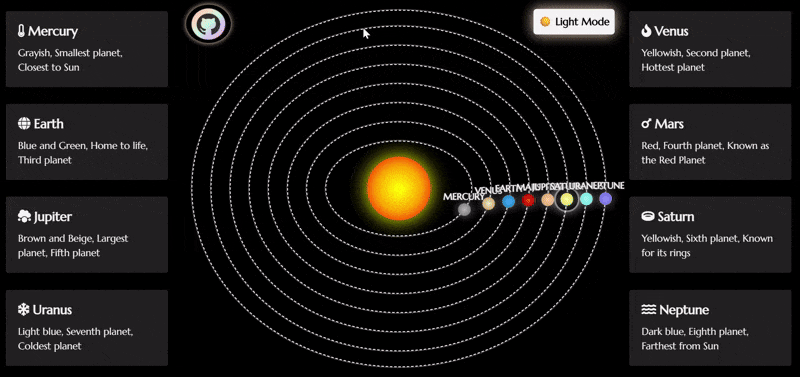
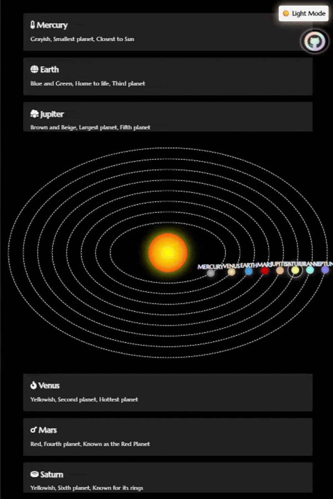
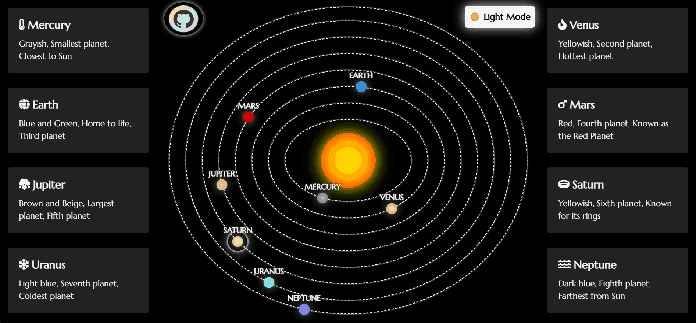
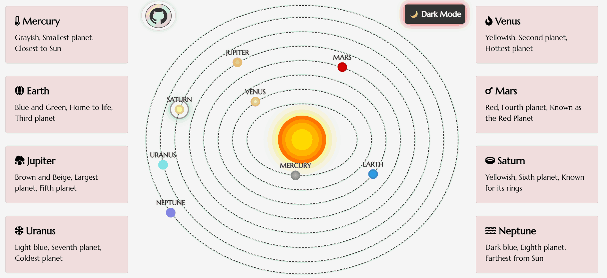

# 🌌 Animated Solar System 🌌

This project is an **interactive solar system visualization** using pure **HTML, CSS, and JavaScript**. It creatively represents each planet with beautiful animations and dynamic UI elements.>

<p align="center">
<a href="https://solarsystem-rouge.vercel.app/">
</a>
<a href="https://solarsystem-rouge.vercel.app/">

</a>
</p>

---

## ✨ Features

* 🌞 Glowing Sun with realistic effects
* 🪐 Animated planetary orbits with gradient styling
* 🧠 Interactive cards showing info on hover
* 🌗 Light/Dark mode toggle for user preference
* 🎯 Fully responsive layout using Bootstrap
* ⭐ Font Awesome icons for stylish visuals
* 🖋️ Elegant typography using Google Fonts
* 💻 Cross-device compatibility

---

## 🗂️ Directory Structure

```bash
📁 Animated-Solar-System/
├── 📄 index.html                # Main HTML page 🌐
├── 📁 css/
│   ├── 🎨 index.css             # Core styling for layout & animations
│   ├── 🌗 light-mode.css        # Styles for light theme
│   ├── 🌑 dark-mode.css         # Styles for dark theme
│   ├── 🪐 planets.css           # Orbit & planet-specific styles
│   ├── 📱 responsive-styles.css # Additional responsive adjustments
│   └── 🎯 targeted-devices.css  # Media queries for specific screen sizes
├── 📁 js/
│   └── 🧩 index.js              # JavaScript for interactivity & toggles
│   └── 🧩 mobile-index.js       # JavaScript for interactivity & toggles (Mobile)
├── 📁 snapshots/                # GIF previews and Static theme snapshots
│   ├── 🖼️ preview.png
│   └── 💡 preview-light.png
├── 📄 README.md                 # You're here! 📘
├── 📄 LICENSE                   # MIT License 📜
└── 📄 CONTRIBUTING.md           # Contribution guidelines 🤝
```

---

## 🛠️ Tech Stack & Dependencies

* **HTML5** – Semantic structure
* **CSS3** – Animations, themes, layout
* **JavaScript** – Dynamic interactivity
* **Bootstrap 4.5.2** – Grid and responsiveness 📦
* **Font Awesome 5.15.4** – Icons ⭐
* **Google Fonts (Marcellus)** – Clean typography 🖋️

---

## 🚀 Usage

> [!TIP]
> Just clone and open `index.html` in any browser!

```bash
git clone https://github.com/sumitshirwa/Animated-Solar_System.git
cd Animated-Solar-System
```


### 🧩 Customize It

* Modify planet data via `data-info` attributes in `index.html` 🪐
* Tweak orbit styles and animations in `index.css` 🎨
* Adjust theme logic and interactivity in `index.js` 🧠

---

## 🖼️ Preview

<p align="center">
<a href="https://solarsystem-rouge.vercel.app/">


</a></p>

---

## 📌 Future Enhancements

* Add moons and asteroid belts 🌑
* 🔁 Planetary rotation animation - animate each planet to rotate around its own axis, mimicking the natural spin observed in real celestial bodies, in addition to their orbital motion around the Sun.
* 🎧 Add interactive sound effects  
* 🪐 Add hover cards for each planet and the Sun  
  * Fix existing hover card layout (currently flows only for Neptune)
* 💫 Saturn's ring tilt – Tilt Saturn’s rings by 45° to simulate a more realistic 3D appearance.
* 🌍 Add 3D depth illusion – Enhance the planetary visuals with shading and gradients to give a more spherical, three-dimensional look.
* 🧹 Refactor CSS – Use relative sizing (`max-height: 25%` for planet cards) instead of fixed pixel values for better scalability across devices.
* 🧮 Dynamic orbit generation – Use JavaScript to calculate orbit sizes as a percentage of the viewport or container width, eliminating the need for separate responsive rules for each device and planet.

---

## 🪐 Live Demo

> [!NOTE]
> Hosted on GitHub Pages platform.
> 
> [🔗 View it live](https://solarsystem-rouge.vercel.app/)

---

## Thanks for Visiting 😄

- Drop a 🌟 if you find this repository useful.<br><br>
